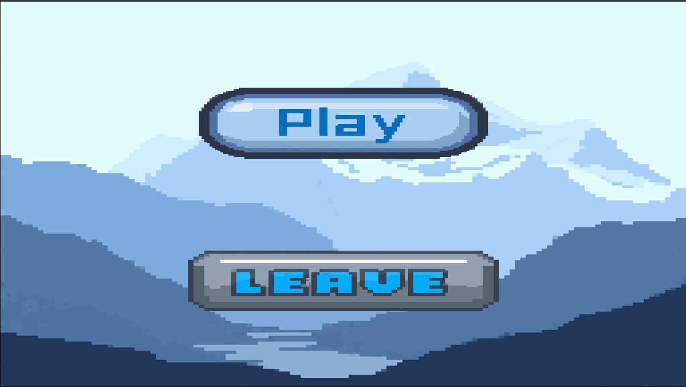
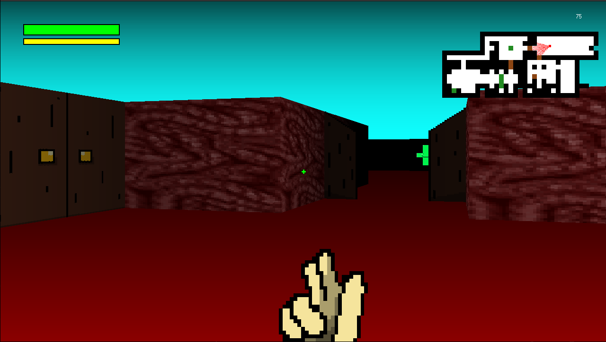

# :video_game: CUB3D - Raycasting Game Engine

[](https://www.cprogramming.com/)
[](https://42.fr)
[](https://github.com/42School/norminette)

<div align="center">
  
</div>

*A 3D maze exploration game built from scratch using raycasting techniques*

## Build project :hammer:

### Commands to build the project

    git clone https://github.com/lcalero42/cub3d.git && cd cub3d
    cd lib && git clone https://github.com/42paris/minilibx-linux
    cd ..
    make
    ./cub3d mandatory/maps/deathcave.cub

>[!IMPORTANT]
>`make bonus` if you want to build the bonus and launch the game with maps in `bonus/maps` 

## Showcase :star:




## Features implemented :rocket:
- *Walls*
- *Doors*
- *Fog*
- *Shooting*
- *Pitch*
- *Player movement (with running)*
- *Collisions*
- *Enemy (With pathfinding)*
- *Health pads*
- *Menu*
- *Health/Stamina bar*
- *Minimap*

## What is cub3d ? :black_medium_small_square:
**Cu3d** is a project in which you need to build a ***Raycaster engine***, coming from a *map* looking like this : 

```
NO mandatory/textures/376.xpm
SO mandatory/textures/376.xpm
WE mandatory/textures/376.xpm
EA mandatory/textures/376.xpm

F 139,0,0
C 139,0,0

        1111111111111111111111111
        1000000000110000000000001
        1011000001110000000000001
        1001000000000000E00000001
111111111011000001110000000000001
100000000011000001110111111111111
11110111111111011100000010001
11110111111111011101010010001
11000000110101011100000010001
10000000000000001100000010001
10000000000000001101010010001
1100000111010101111101111000111
11110001 1110101 101111010001
11111111 1111111 111111111111

``` 

To a **rendering** like this using **mlx** : 

PUT IMAGE HERE

## Controls :computer:

Colons can be used to align columns.

| KEY        	|Action          
| ------------- |:-------------:|
| `W`     		| *Move forward*  |
| `A`      		| *Move to the left*		|
| `S`				| *Move backward*      	|
| `D`				| *Move to the right*     |
| `Shift + moving key`| *Sprint*    |
| `Left Arrow`		| *Rotate left*     		|
| `Right Arrow`		| *Rotate right*     		|
| `Mouse`		| *Rotate up and down*     		|
| `Left click`| *shoot*     		|
| `Space`			| *Open door*     		|
| `F`				| *Toggle fog*     		|
| `M`				| *Toggle mouse*     		|
| `Esc`				| *Leave game*     		|

## Parsing :fax:

## **Raycasting logic** :green_book:

***Raycasting*** is a **rendering technique** that is used to **reproduce `3D environment`**, even though it is not actual 3D.
Raycasting is a technique that (based on a grid that is used as the map) consists of **casting rays** for each column of the screen until it reaches a wall or a blocking structure (such as closed doors) ***and renders associated pixels*** in this column only.


### **Algorithm used : DDA (Digital differential analyzer)**

**DDA (Digital Differential Analyzer)** is a line drawing algorithm used in computer graphics to ***generate a line segment*** between two specified endpoints. Here, the two endpoints are *the player* (his position will be where the ray starts) and *the wall* or blocking structure.

#### The steps involved in DDA line generation algorithm are :

  1. Input the **two endpoints** of the line segment, *(x1,y1)* and *(x2,y2)*.
  2. Calculate the difference between the *x-coordinates* and *y-coordinates* of the endpoints as dx and dy respectively.
  3. Calculate the **slope** of the line as m = dy/dx.
  4. Set the **initial point** of the line as *(x1,y1)*.
  5. Loop through the *x-coordinates* of the line, incrementing by one each time, and calculate the corresponding *y-coordinate* using the equation ***y = y1 + m(x - x1)***.
  6. Plot the pixel at the calculated *(x,y)* coordinate.
  7. **Repeat steps 5 and 6 until the endpoint *(x2,y2)* is reached.**

Here, we have a *subtle difference* it term of use of **the algorithm**, which is that we don't know the coordinates of the point we want to go to, so we want to **loop indefinitely** until we reach a blocking structure.

**I would sum up the use of the algorithm here to be :** 

  1. initiate the **starting coordinates** (player coordinates).
  2. increment from the starting coordinates by **adding the *step* accordingly**
  ```C
  void	perform_dda_step(t_data *data, int i)
{
	if (data->rays[i].side_dist.x < data->rays[i].side_dist.y)
	{
		data->rays[i].side_dist.x += data->rays[i].delta_dist.x;
		data->rays[i].map_pos.x += data->rays[i].step.x;
		data->rays[i].side = 0;
	}
	else
	{
		data->rays[i].side_dist.y += data->rays[i].delta_dist.y;
		data->rays[i].map_pos.y += data->rays[i].step.y;
		data->rays[i].side = 1;
	}
}
```

3. Once we know we've **reached a wall**, we **store the current *coordinates*** of the ray and we calculate the **distance between the player and the point reached**
```C
static int	handle_hit(t_data *data, int i, t_pos map_pos)
{
	t_door	*door;
	char	cell;

	if (map_pos.x < 0 || map_pos.x >= data->grid.width
		|| map_pos.y < 0 || map_pos.y >= data->grid.height)
		return (1);
	cell = data->grid.grid[map_pos.y][map_pos.x];
	if (cell == '1')
	{
		store_hit(data, i, map_pos, 1);
		return (1);
	}
	else if (cell == '2')
	{
		door = &data->door_grid[map_pos.y][map_pos.x];
		if (door)
		{
			store_hit(data, i, map_pos, 2);
			if (door->state == DOOR_CLOSED)
				return (1);
		}
	}
	return (0);
}
```
4. **repeat these 3 first steps for each column of the screen/window width**

### **Rendering (using mlx) :**


> [!NOTE]
> Note that the logic of rendering should be the same even if you are not using  mlx but the code provided will be adapted to mlx and it can differ if you use an other library

When building video games, one of the basics to know is a ***drawing loop***. Here basically we want that loop to look be like this :
1. **Clear the screen** (needed because we want to completely clear whatever we have drawn in the previous frame)
2. **Update** all the data we need (player position, cast rays, calculate delta time)
3. **Draw the walls and doors**
4. **Draw the sprites**

And we want to **iterate indefinitely** in that loop until the user wants to leave. The **order of rendering** is very important if we want it to be a little bit realistic. This is **layered rendering**.
> Example : 
> In a **FPS** (First Person Shooter), we want to render the gun that the player is holding in the **lasts sprites** that you render on the screen, otherwise you would see the textures of the game above the gun which would look pretty weird

```C
int  render_loop(t_data  *data)
{
	if (!handle_scene(data))
		return (0);
	calc_delta_time_ms(data);
	update_player_movement(data);
	update_enemy_movement(data);
	trace_ray(data, data->player.angle);
	animation_routine(data);
	clear_screen(data);
	render_walls(data);
	render_enemy_with_health(data, &data->enemy);
	render_crosshair(data);
	render_gun(data);
	render_health_bar(data, &data->health_bar);
	render_stamina(data, &data->stamina_bar);
	mlx_put_image_to_window(data->mlx, data->window, data->render_img, 0, 0);
	calculate_fps(data);
	render_minimap(data);
	return (1);
}
```

> [!NOTE]
> For the game to be **frame rate independent**, we calculate a **delta time**, which is the elapsed time since the program last updated and we will make scale all the movement/speed calculations with this delta time so that for example, the player goes the same speed when we have good or bad CPU

 #### Floor/sky rendering :
 The **`floor`** or **`Ceiling` rendering** here is very simple, we just need to draw for each row from top of the screen the color of the sky until we reach h**alf the height of the screen** and then, draw the other half with the floor color.
 
```C
void	clear_screen(t_data *data)
{
	int	x;
	int	y;

	y = -1;
	while (y++ < WINDOW_HEIGHT / 2)
	{
		x = -1;
		while (x++ < WINDOW_WIDTH)
			put_pixel_to_image(data, x, y,
				u_rgb_to_hex(data->ceiling.base_r,
					data->ceiling.base_g, data->ceiling.base_b, 0));
	}
	while (y++ < WINDOW_HEIGHT)
	{
		x = -1;
		while (x++ < WINDOW_WIDTH)
			put_pixel_to_image(data, x, y,
				u_rgb_to_hex(data->floor.base_r,
					data->floor.base_g, data->floor.base_b, 0));
	}
}
```
>[!NOTE]
>knowing that in the bonus part we implemented a feature that permits to the player to look up and down, we should adapt rendering knowing this by adding *pitch offset* every time we want to render : walls, ground/sky, sprites...

#### Wall rendering :

Each ***vertical slice*** of the screen represents a **ray cast** into the game world to detect the **distance to the nearest wall**. That distance is used to calculate ***how tall the wall should appear on screen*** and where to start and stop drawing it, creating a sense of **depth**. Texture coordinates are then mapped proportionally to that wall segment, giving the **illusion of a 3D environment** from a *2D grid*

> Main wall rendering function :
```C
void  render_walls(t_data  *data)
{
	int  x;
	int  draw_start;
	int  draw_end;
	double  perp_wall_dist;

	x  =  0;
	while (x  <  WINDOW_WIDTH)
	{
		data->rays[x].perp_wall_dist  =  calculate_perp_wall_dist(data, x);
		perp_wall_dist  =  data->rays[x].perp_wall_dist;
		calculate_wall_bounds(perp_wall_dist, &draw_start, &draw_end);
		draw_wall_column(data, x, draw_start, draw_end);
		x++;
	}
}
```
> You may now understand that this is not **actual** 3D, it is only creating an illusion of 3D by rendering an effect of depth. Nowhere in the code we use 3D coordinates, only 2D. And this **raycasting** system being very useful at the time it was created, is still limited. For example, the fact that we don't have 3D coordinates makes it impossible for the player to jump, or go to different "floors". 

#### Sprite rendering (bonus part) :
**Sprites** (which are not mandatory in this project) can be hard to **render properly**. I would separate this part in two, first the `static sprites` that never move (flowers, grass...) and `moving sprites` :
1. First, the `static sprites`. An easy way to do this is by ***adding them to the map with a special letter/character***. For example, in our game, we included heal pads that never moves, and added them to the map with the letter "H". We choose to store all their ***positions*** in a ***big array*** at the initialization of the program. Then, if we have that, we can calculate distance between the *player* and *the pad* easily and render it accordingly. Of course, we also need to know for each column of the sprite if it is hidden by a wall or a door by calculating if the **distance between the first wall/door we cross** is ***higher*** than the **distance between the sprite and the player**. If it is, we can draw the column.
2. Then, for `moving sprites` such as *enemies*, knowing that we update the position ourselves, we can easily calculate **distance between the player and the moving sprite**. As we do with `static sprites`, we calculate if the sprite is hidden by a wall but there is still one thing left to do, which is that we need to **layer** it with other sprites accordingly. For example, if the enemy is behind a pad of heal, we must render it **also** behind the pad of heal.

### Conclusion :
Here is all the basics you will need to implement your own **raycaster** engine ! Even though this is not a method used nowadays, it is still fun to practice and it definitely makes you familiar with building a game and rendering pixels on a window at a low level.

## Fun things we have learned :smile:

- Build a **Raycaster**
- **`Math library`** usage
- Window handling
- Optimization with ```valgrind --tool=callgrind ./program``` that permits to easily see where you can **optimize** your code by passing the .out file in  *`Kcachegrind`*
- Basic **game rendering logic** (drawing loop, delta time...)
- Color management (RGBA or hexadecimal)
- **Animation logic**
- ***`Github projects`*** usage to create drafts of features to implement or reporting *issues*
- `A* algorithm` to find the ***shortest path*** between *player* and *enemy* so that the *enemy* always move towards the *player*

## Contributors :wave:

- [**lcalero**](https://github.com/lcalero42)
- [**ekeisler**](https://github.com/eterrale)

## Useful ressources :paperclip:

- https://lodev.org/cgtutor/raycasting.html
- https://xitog.github.io/dgx/passetemps/tech_raycasting_fr.html
- https://perso.esiee.fr/~buzerl/sphinx_IMA/80%20raycast/raycast.html
- https://www.geeksforgeeks.org/computer-graphics/dda-line-generation-algorithm-computer-graphics/
- https://harm-smits.github.io/42docs/libs/minilibx/getting_started.html
